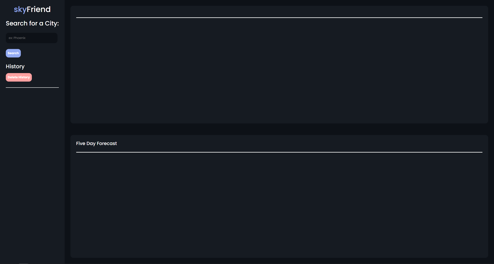
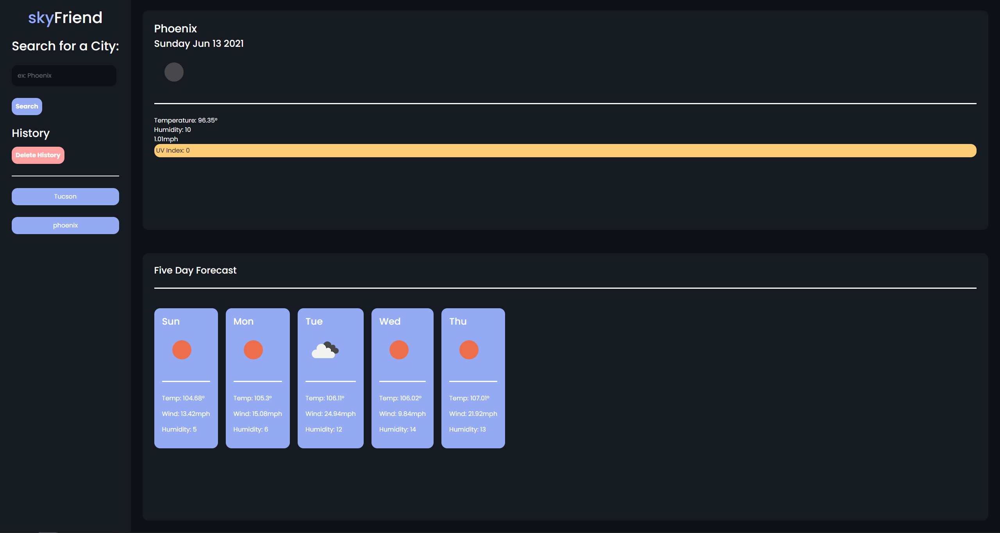

# skyFriend - Weather Application

## About This Project

#### The skyFriend application serves as a solution to those who are planning a trip and would like to know the weather of various locations and compare them to find the most favorable place to visit.

## How it works:

#### The program allows you to search for City names and see the weather of that city as well as look at past searches in your history bar and reload the information from those cities
#### Please keep in mind that after every revisit of the web page you must hit the delete history button or else your history will not show correctly

### skyFriend Before Searching

### skyFriend After Searching

## Motivation:

#### I wanted to create an application that allows individuals who would like to plan a trip around the weather to easily and quickly pull accurate information about multiple cities individually and then be able to look back over previously searched cities so that they may compare the weather and find the location with the best conditions for their trip

## Challenges:

#### I struggled to find a way to index over the history as well as find a way to create event listeners for my dynamically created buttons